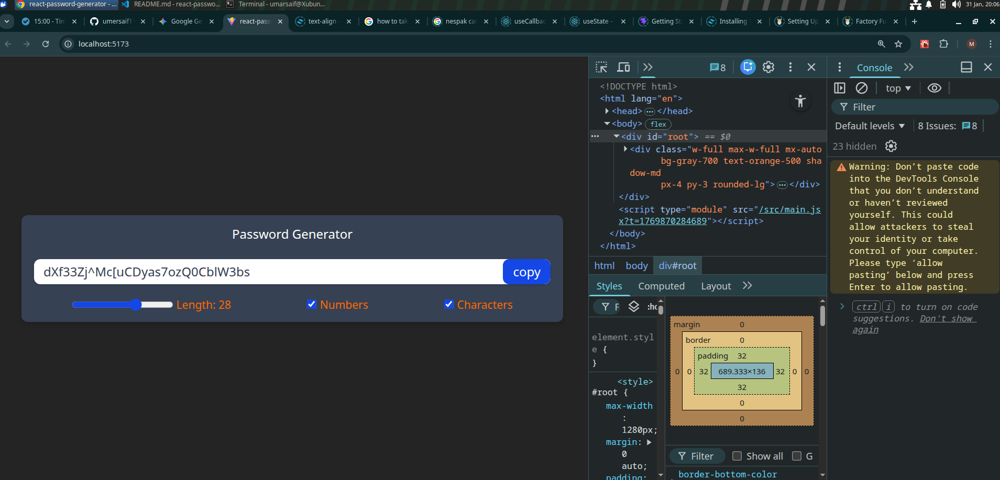

# React Password Generator 🔐

A highly optimized password generator application built with React and Tailwind CSS. This project focuses on handling complex state, optimizing performance with hooks, and interacting directly with the DOM.

## 🚀 Features

- **Customizable Security:** Adjust password length (6-100 characters).
- **Character Options:** Toggles for including Numbers and Special Characters.
- **Instant Feedback:** Password regenerates automatically as you change settings.
- **Clipboard Integration:** One-click "Copy" button with visual selection feedback.
- **Optimized Performance:** Uses memoization to prevent unnecessary re-renders.

## 🛠️ Tech Stack

- **Library:** React JS
- **Styling:** Tailwind CSS
- **Build Tool:** Vite

## 🧠 Concepts & Hooks Used

This project was built to master React Hooks. Here is how each one is used:

- **`useState`**: Managing the state of variables like `length`, `numberAllowed`, `charAllowed`, and the generated `password`.
- **`useCallback`**: Used to **memoize** the `passwordGenerator` function. This ensures the function is cached and only recreated when dependencies (length/settings) change, optimizing performance.
- **`useEffect`**: Triggers the password generation logic automatically whenever the page loads or the user updates the dependencies (length, numbers, etc.).
- **`useRef`**: Used to create a reference to the input field. This allows us to programmatically **select/highlight** the text inside the input box when the user clicks "Copy", providing better visual feedback.

## 🖥️ Screenshots

**Password Generator**



## 💻 How to Run Locally

1. **Clone the repository**
   ```bash
   git clone [https://github.com/yourusername/react-password-generator.git](https://github.com/yourusername/react-password-generator.git)

2. Navigate to the project directory
```bash
   cd react-password-generator
```    
3. Start the development server
```bash
   npm run dev
```  
   